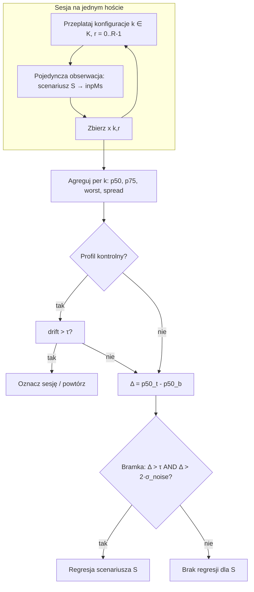

# CWV Lab

Laboratorium pomiaru **INP** i interakcji w kontrolowanym środowisku.  
Stack: **Playwright** (symulacja wejścia, orchestracja, agregacja) + **Lighthouse** (snapshot audytu; `npm run lh`).

Szczegóły implementacji vs wytyczne hosta: [`BENCH_PREREQUISITES.md`](./BENCH_PREREQUISITES.md).  
Macierz profili POC: [`TEST_PROFILES.md`](./TEST_PROFILES.md), plik `bench-matrix.profiles.json`.

---

## Jak dokumentować jeden przebieg (arkusz / raport)

Każdy wiersz = **jeden punkt eksperymentu** (jedna konfiguracja macierzy × zestaw scenariuszy).  
Nagłówki grupują odpowiedzialność — nie mieszaj „co badamy” ze „gdzie mierzymy”.

| **Eksperyment** | | | | **Metodologia** | | **Środowisko uruchomieniowe** | | | | **Wynik** | **Uwagi** |
| --- | --- | --- | --- | --- | --- | --- | --- | --- | --- | --- | --- |
| Nazwa | Obszar widoku | Polityka uruchomienia (warmup) | Scenariusz | Próg decyzyjny (acceptable delta) | Agregacja | Wersja aplikacji | Zasoby (assety, API, flagi) | Przeglądarka | Host | | |
| *np. `desktop-cold`* | *1280×720* | *`cold`* | *A–D, `scenarios-a-d.spec.ts`* | *±40 ms* | *5× run, p50/p75/p95, worst, trim 10%* | *commit / obraz* | *mock API, prod build* | *Chromium headless* | *Docker / lokalnie* | *link do `summary.tsv`* | *retry, anomalie* |

**Co wpisać w kolumnach (skrót):**

- **Nazwa** — `configurations[].id` lub etykieta biznesowa przebiegu.
- **Obszar widoku** — `BENCH_VIEWPORT_WIDTH` × `BENCH_VIEWPORT_HEIGHT`.
- **Polityka uruchomienia** — `BENCH_WARMUP`: `cold` | `warm_assets` | `warm_session` (patrz [Warmup](#warmup)).
- **Scenariusz** — które flow (A–D) i plik testów; opcjonalnie profil slowdown (`BENCH_SLOW_*`) jeśli to oś eksperymentu.
- **Próg decyzyjny** — `acceptableDeltaMs` z macierzy (domyślnie **±40 ms**); dopisz **względem czego** (baseline, poprzedni build, inna konfiguracja).
- **Agregacja** — `runs`, percentyle, `trimExtremesPercent`, lista metryk (`inpMs` jako sygnał główny).
- **Wersja aplikacji** — git SHA, tag, digest obrazu (poza JSON macierzy — z CI lub ręcznie).
- **Zasoby** — mock vs backend, build statyczny vs `ng serve`, flagi, sesja.
- **Przeglądarka** — Chromium, headless / headed + Xvfb (`BENCH_HEADED`, `BENCH_USE_XVFB`).
- **Host** — laptop, runner CI, dedykowany node; `PLAYWRIGHT_BASE_URL`.

---

## Środowisko uruchomieniowe

Wymagania labu podzielone na warstwy. Kolumna **W repozytorium?** odnosi się do tego POC.

### A) Urządzenie (Device)

| Wytyczna | Cel | W repozytorium? |
| --- | --- | --- |
| Stabilność CPU (np. wyłączony turbo boost) | Mniej rozrzutu między runami | Nie — OS / bare metal / obraz node’a |
| Wirtualny monitor (Xvfb) | Headful na Linuxie bez fizycznego display | Częściowo — `BENCH_USE_XVFB=1`, `docker-entrypoint.sh` |
| Stała RAM / brak presji swap | Powtarzalność GC i I/O | Nie — orchestracja VM |
| Stabilna ścieżka GPU (ten sam GPU lub stały software rendering) | Spójny rendering | Częściowo — `BENCH_HEADED`, flagi Chromium; pin drivera na hoście |
| Stabilność termiczna (unikanie throttlingu) | Długie serie runów | Nie |
| Ta sama wersja kernela | Porównania między dniami | Nie — golden image hosta |

### B) System

| Wytyczna | W repozytorium? |
| --- | --- |
| Powtarzalna, stabilna konfiguracja | Częściowo — Docker + lockfile |
| Minimum procesów w tle | Nie |
| Stała wersja przeglądarki | Częściowo — pin `@playwright/test` + browsers w CI/Docker |
| Stała strefa czasowa / locale | Tak — `UTC`, `en-US` w `playwright.config.ts` |
| Stałe fonty zainstalowane | Częściowo — fonty systemowe; subset w bundlu dla ostrzejszego labu |
| Wyłączone auto-update | Nie |
| Wyłączone cron / zadania harmonogramu | Nie |
| Stabilne DNS (lub lokalny cache) | Częściowo — mock API ogranicza ruch zewnętrzny |
| Ta sama rozdzielczość / głębia koloru | Częściowo — viewport, `deviceScaleFactor: 1`, `XVFB_*` |
| Ten sam profil użytkownika przy każdym runie | Częściowo — **świeży kontekst** na run; `cold` czyści storage |

### C) Przeglądarka (Browser)

| Wytyczna | W repozytorium? |
| --- | --- |
| Ta sama wersja Chromium | Częściowo — lock Playwright |
| Wyłączone background networking | Częściowo — `launchOptions.args` |
| Wyłączone rozszerzenia | Tak — domyślny profil bez rozszerzeń |
| Stabilne throttling sieci | Częściowo — mocki; jawny throttle — do dodania |
| Ten sam viewport | Tak — `BENCH_VIEWPORT_*` |
| Świeży, czysty profil na run | Tak — izolowany kontekst; `cold` czyści cookies/storage |

### D) Aplikacja (Application)

| Wytyczna | W repozytorium? |
| --- | --- |
| Mock wszystkich wywołań backendu | Tak — `installBenchMocks`, fixtures |
| Stałe payloady | Tak — `product-demo.json` itd. |
| Stałe odpowiedzi obrazów | Tak — m.in. data URL w fixture |
| Stałe flagi funkcji | Częściowo — rozszerzyć mocki |
| Stały stan auth / sesji | Częściowo — `warm_session` seeduje `sessionStorage` |
| Zbudowane assety frontu (HTML, JS, CSS) | Tak — `ng build`, `serve` w Dockerze |
| Deterministyczny cache obrazów | Częściowo — inline / mock |
| Deterministyczna ścieżka ładowania fontów | Częściowo — fonty systemowe |

---

## Pomiar (Measurements)

### A) Symulacja wejścia (Playwright)

Stałe cele i timingi — scenariusze w `e2e/scenarios-a-d.spec.ts`:

- ten sam element (`data-testid` / selektor),
- ten sam rytm kliknięć i pisania,
- ten sam wzorzec scrollu,
- te same czasy oczekiwania przed akcją (`THINK_MS`, opóźnienia klawiszy).

### B) Warmup {#warmup}

| Tryb (`BENCH_WARMUP`) | Znaczenie w labie |
| --- | --- |
| `cold` | Zimna przeglądarka / storage — cookies i storage czyszczone przed testem |
| `warm_assets` | Rozgrzany cache HTTP/assetów (preload, potem `about:blank`) |
| `warm_session` | Rozgrzana sesja (seed `sessionStorage` po pierwszym wejściu) |

Odpowiednik osi macierzy **Cache State** (cold / warm assets / warm full session).

### INP (web-vitals)

Aplikacja rejestruje **`onINP`** (`src/web-vitals-bench.ts`). Testy czytają **`inpMs`** z `window.__CWV_BENCH_VITALS__.inp` po `settleWebVitalsInp()`.  
`eventTimingMaxMs` — sonda pomocnicza Chromium; `wallClockMs` / `searchTypingWallMs` — metryki wspierające per scenariusz.

### Sztuczne obciążenie (kalibracja / regresja)

`BENCH_SLOW_CLICK_JSON` / `BENCH_SLOW_KEYDOWN_JSON` — spin na `data-testid` (`src/bench-slowdown.ts`).  
Porównanie baseline vs slow: `npm run bench:compare` → `bench-matrix.compare.json`.

---

## Profile testowe (macierz osi)

**Macierz N (idealna)** — pełny kartezjański produkt osi (docelowo wiele plików `bench-matrix.*.json` lub etykiet runnera).  
**Macierz realistyczna (POC)** — dziś głównie: **mockowany frontend lab** + osie już w JSON.

| Oś | Wartości (ideal) | Stan POC |
| --- | --- | --- |
| **1. Environment Fidelity** | 1) Czysty frontend + mocki · 2) SSR + mocki API · 3) Pełny staging · 4) Production shadow synthetic | **(1)** — mocki, statyczny build |
| **2. Features composition** | Z / bez skryptów third-party | Nie modelowane — osobna konfiguracja / URL |
| **3. Browser Mode** | Headless · Headful + Xvfb · Headful na realnym desktop node | Headless domyślnie; **Xvfb** w Dockerze (`BENCH_USE_XVFB`) |
| **4. Resource Strictness** | Shared runner · Dedicated benchmark node · Pinned CPU cores | Nie w JSON — K8s / Nomad / host |
| **5. Cache State** | Cold browser · Warm assets · Warm full session | Tak — `BENCH_WARMUP` w `bench-matrix.profiles.json` |

Dodatkowe osie w plikach macierzy (nie na liście idealnej, ale używane):

- **Viewport** — desktop 1280×720 vs mobile-ish 390×844.
- **Targeted slowdown** — off vs mapa opóźnień (`compare`, profile `*-targeted-slowdown`).

Uruchomienie profili POC:

```bash
npm run bench:profiles
```

---

## Scenariusze testowe (A–D)

Dla każdego scenariusza: **5–10 runów** na konfigurację; zapisuj **medianę (p50), p75, najgorszy run** — jedna liczba nie wystarcza.  
Implementacja: trasy `/scenario/...`, testy `e2e/scenarios-a-d.spec.ts`.

| ID | Cel | Przebieg (skrót) | Mierzona interakcja |
| --- | --- | --- | --- |
| **A** | Świeża responsywność po wejściu na produkt | Otwórz stronę produktu → idle → klik w galerii | Klik miniatury galerii |
| **B** | UI po stanie (filtry po przeglądaniu) | Home → kategoria → scroll → filtry 1–3 | **4.** filtr (klik) |
| **C** | Pisanie w polu wyszukiwania (warm) | Home → search → wpisz „telewizor samsung” | INP per klawisz / faza pisania |
| **D** | Koszyk po ścieżce | Kategoria → dodaj → koszyk → **+** | INP na `+` w koszyku |

---

## Algorytm dla jednego scenariusza

Poniżej **jeden scenariusz** = jeden wiersz w `summary` (np. `scenario-b-fourth-filter`, metryka `inpMs`).  
Przykład kotwiczący: **scenariusz B** (klik 4. filtra po filtrach 1–3). Ten sam schemat działa dla A/C/D — zmienia się tylko `scenarioId` i metryka pomocnicza (np. `searchTypingWallMs` w C).

### Parametry wejściowe

| Symbol | Znaczenie | Typowy POC |
| --- | --- | --- |
| `S` | Id scenariusza (`scenario-b-fourth-filter`) | stały |
| `M` | Metryka decyzyjna | `inpMs` |
| `K` | Konfiguracje do porównania | np. `baseline`, `slow-targeted` |
| `R` | Replikacje na konfigurację | **≥ 5** na decyzję; 2 tylko smoke |
| `W` | Warmup (`BENCH_WARMUP`) | np. `cold` — stały w sesji |
| `τ` | `acceptableDeltaMs` | 40 |
| `α` | Trim skrajów (%) | 10 w profiles |
| `C` | Profil kontrolny (opcjonalny) | ten sam co baseline, co `B` przebiegów w sesji |

Stałe w sesji (jedna kohorta): **host**, **build aplikacji**, **viewport**, **tryb przeglądarki**. Nie porównuj wyników między kohortami.

---

### Faza 1 — Pojedyncza obserwacja (jeden run Playwright)

Dla konfiguracji `k ∈ K`, indeks replikacji `r ∈ [0..R-1]`:

```
1. Ustaw env macierzy (viewport, warmup W, slowdown JSON jeśli dotyczy k).
2. prepareBenchPage(page, context)     // izolowany kontekst; cold → clear storage
3. warmupNavigation(page, W, url)    // polityka cache/sesji aplikacji
4. Wykonaj scenariusz B (deterministyczna ścieżka):
     goto /scenario/b → go-category → scroll → filter-1..3 → filter-4 (AKCJA)
5. collectLabMetrics(page):
     settleWebVitalsInp → odczyt inpMs (+ eventTimingMaxMs)
6. Zapisz próbkę x[k,r] = inpMs dla S; odrzuć run jeśli test failed / brak inpMs
```

**Jedna obserwacja** = jedna wartość `inpMs` po **ostatniej** interakcji pomiarowej (tu: `filter-4`). Filtry 1–3 są częścią ścieżki, nie osobnymi próbkami w agregacie B.

---

### Faza 2 — Harmonogram sesji (kompensacja szumu urządzenia)

Zamiast `R` runów config A, potem `R` runów config B:

```
Dla i = 0 .. R-1:
  dla każdego k w K (w ustalonej kolejności, np. alfabetycznie po configId):
    wykonaj Fazę 1 → x[k,i]

Opcjonalnie co T replikacji (np. T=2):
  wykonaj Fazę 1 dla profilu kontrolnego C → x_ctrl[j]
```

Efekt: **przeplatanie** — dryf CPU/termiki wpływa na obie konfiguracje podobnie w tej samej sesji.

Reguły jakości:

- **Odrzuć** `r=0` z analizy decyzyjnej (opcjonalna „rozgrzewka urządzenia”), jeśli polityka labu tak stanowi — wtedy faktyczne `R' = R-1`.
- **Odrzuć** całą sesję, jeśli kontrola przed/po skacze o więcej niż `τ` bez zmiany kodu (patrz Faza 4).

---

### Faza 3 — Agregacja w obrębie jednej konfiguracji

Dla konfiguracji `k`, zbiór próbek `X_k = { x[k,r] | run OK }`, posortuj rosnąco:

```
n_k = |X_k|
X'_k = trim(X_k, α)          // np. obetnij 10% z każdej strony gdy n_k ≥ 10
p50_k = percentile(X'_k, 50)
p75_k = percentile(X'_k, 75)
p95_k = percentile(X'_k, 95)
worst_k = max(X_k)           // z pełnego X_k, nie z trimmed — strażnik ogona
spread_k = p75_k - p50_k     // szacunek szumu urządzenia w tej konfiguracji
```

**Raportuj** (minimum): `n_k`, `p50_k`, `p75_k`, `worst_k`, `spread_k`.  
Bez `n_k ≥ 5` **nie** wydawaj werdyktu regresji — tylko eksploracja.

To odpowiada `bench-aggregate.mjs` dla jednego `(configId, scenarioId, metric)`.

---

### Faza 4 — Dryf sesji (profil kontrolny, opcjonalny)

Jeśli masz profil kontrolny `C` (np. `desktop-cold` bez slowdown):

```
drift = |p50_C,po - p50_C,przed|   // kontrola na początku i końcu sesji
```

- Jeśli `drift > τ` → **sesja podejrzana**; powtórz sesję lub oznacz wynik w kolumnie Uwagi.
- Przy porównaniu buildów: możesz skorygować  
  `Δ_adj = (p50_kandidat - p50_baseline) - drift` (prosta korekta liniowa).

---

### Faza 5 — Porównanie między konfiguracjami (ten sam scenariusz S)

Przy porównaniu **baseline** (`b`) vs **kandydat** (`t`) — np. wolniejszy profil labu:

```
Δ_p50 = p50_t - p50_b
Δ_p75 = p75_t - p75_b
Δ_worst = worst_t - worst_b
σ_noise = max(spread_b, spread_t, (p95_b - p50_b) / 2)   // konserwatywny szum urządzenia
```

Interpretacja: interesuje **wzrost** opóźnienia (regresja), nie poprawa.

---

### Faza 6 — Bramka decyzyjna (jeden scenariusz, jedna kohorta)

```
REGRESJA :=
  (n_b ≥ 5 AND n_t ≥ 5)
  AND (Δ_p50 > τ OR Δ_p75 > τ)
  AND (Δ_p50 > k_min * σ_noise)    // k_min = 2 (domyślnie; szum nie może „wyjaśnić” całej delty)

ALARM_OGON :=
  (worst_t - worst_b > τ) OR (p95_t - p95_b > τ)

WERDYKT:
  jeśli REGRESJA → fail / review wymagany
  jeśli tylko ALARM_OGON bez REGRESJA → uwaga (niestabilny ogon urządzenia)
  w przeciwnym razie → brak regresji dla S
```

**±40 ms** (`τ`) dotyczy **delty między konfiguracjami na tym samym hoście**, nie absolutnego `inpMs`.  
Warunek `Δ > k_min * σ_noise` chroni przed fałszywym alarmem przy dużym rozrzucie urządzenia.

---

### Faza 7 — Wpis do arkusza (jeden wiersz eksperymentu × scenariusz)

| Kolumna | Wartość |
| --- | --- |
| Scenariusz | B — `scenario-b-fourth-filter` |
| Metodologia | `R=5`, trim `α=10%`, bramka `τ=40`, `k_min=2` |
| Wynik (baseline) | `p50_b`, `p75_b`, `worst_b`, `n_b`, `spread_b` |
| Wynik (kandydat) | `p50_t`, … |
| Wynik (decyzja) | `Δ_p50`, REGRESJA tak/nie, ALARM_OGON tak/nie |
| Uwagi | `drift`, host, commit, „sesja powtórzona” |

---

### Diagram przepływu



---

### Mapowanie na repo (dziś vs docelowo)

| Krok algorytmu | Stan POC |
| --- | --- |
| Faza 1 (pomiar) | `e2e/scenarios-a-d.spec.ts`, `collectLabMetrics` |
| Faza 2 (przeplatanie) | Orchestrator: **najpierw całe `k`, potem `r`** — przeplatanie **nie** zaimplementowane |
| Faza 3 (agregacja) | `bench-aggregate.mjs` |
| Faza 4 (kontrola) | Ręcznie / osobny wiersz macierzy |
| Faza 6 (auto-bramka) | `acceptableDeltaMs` tylko w logu — **nie** auto-applied |

Kolejny krok implementacyjny: orchestrator v2 z `lab.methodology.schedule: 'interleave' | 'sequential'` (plan w [`v2/src/schedule.ts`](./v2/src/schedule.ts), opis w [`v2/README.md`](./v2/README.md#run-schedule)) i skrypt `bench-gate.mjs` liczący Fazy 5–6 dla wybranego `scenarioId`.

---

## Wyniki i metodologia

| Element | Ustalenie |
| --- | --- |
| **Replikacja** | `runs` w macierzy (np. 5 w profilach, 2 w `compare`) |
| **Agregacja** | `bench-aggregate.mjs` → p50, p75, p95, **worst**, opcjonalny trim |
| **Metryki eksportu** | `inpMs` (główna), `eventTimingMaxMs`, `wallClockMs`, `searchTypingWallMs` |
| **Akceptowalne fluktuacje** | **±40 ms** (`acceptableDeltaMs`) — próg do bramki CI / review; doprecyzuj baseline w kolumnie metodologii |
| **Artefakty** | `bench-results/raw/*.json`, `bench-results/summary.tsv` |

**Metodologia poza JSON (opis stały lub uwagi w wierszu):**

- ten sam commit / obraz przy porównaniu konfiguracji,
- nie mieszaj wyników Docker vs laptop bez oznaczenia w **Host**,
- przy `CI=1` uwzględnij retry Playwrighta w interpretacji worst case.

---

## Szybkie komendy

| Cel | Komenda |
| --- | --- |
| Macierz profili (viewport × warmup × slow) | `npm run bench:profiles` |
| Baseline vs slowdown | `npm run bench:compare` |
| Szybki smoke | `npm run bench:fast` |
| Lighthouse | `npm run lh` |
| Docker + Xvfb | `docker run --rm -e BENCH_USE_XVFB=1 …` (patrz `BENCH_PREREQUISITES.md`) |

---

## Powiązane pliki

| Plik | Rola |
| --- | --- |
| `bench-matrix.profiles.json` | Macierz realistyczna POC |
| `bench-matrix.compare.json` | Baseline vs targeted slowdown |
| `bench-matrix.config.json` / `.fast.json` | Viewport / smoke |
| `scripts/bench-orchestrator.mjs` | Pętla konfiguracje × runs |
| `scripts/bench-aggregate.mjs` | Agregacja i summary |
| `playwright.config.ts` | Viewport, locale, Chromium, webServer |
| `BENCH_PREREQUISITES.md` | Mapowanie wytycznych ↔ kod |
