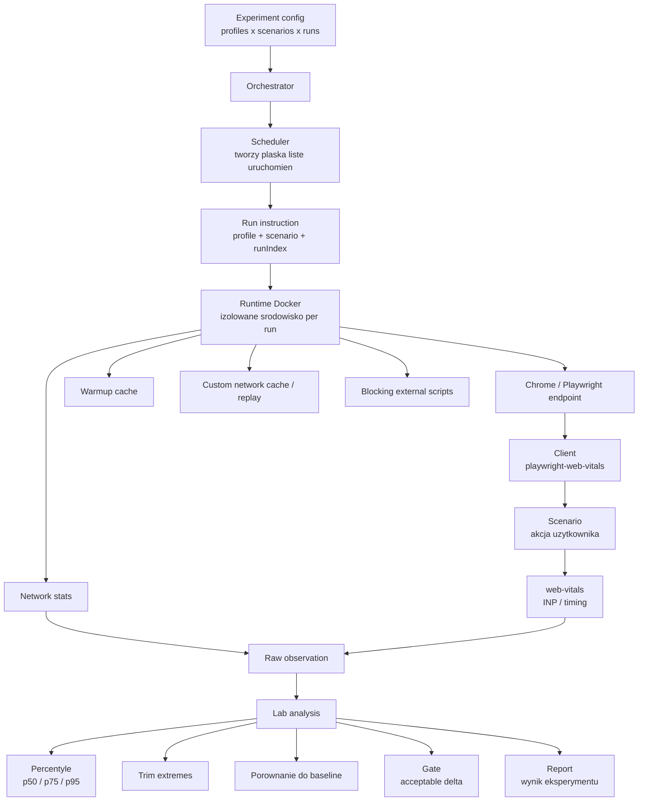
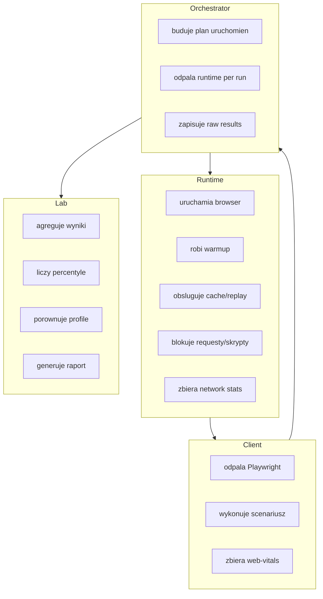
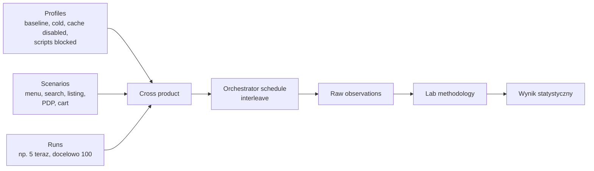

# CWV Test Bench

Lab do porownywania wplywu konfiguracji runtime na Core Web Vitals, przede
wszystkim INP, dla realnych scenariuszy uzytkownika.

Aktualny glowny przypadek uzycia to `euro.com.pl`: scenariusze Playwright
wykonuja konkretne akcje uzytkownika, runtime kontroluje przegladarke i siec,
a lab agreguje wyniki z wielu przebiegow.

## Architektura



## Podzial Odpowiedzialnosci



## Model Metodyki



Orchestrator nie liczy wyniku metodologicznego. Jego odpowiedzialnosc to
rozwiniecie `profiles x scenarios x runs` do plaskiej listy instrukcji i
uruchomienie ich w izolowanym runtime.

Lab dostaje raw observations i dopiero tam liczy wynik.

## Metodyka Liczenia

Kazdy run zapisuje raw observation dla kombinacji:

```text
profile x scenario x run
```

Agregacja jest liczona osobno dla:

```text
profileId x scenarioId x clientId x metric
```

Dla kazdej metryki:

1. brane sa tylko poprawne obserwacje (`status = ok`),
2. wartosci sa sortowane rosnaco,
3. opcjonalnie obcinane sa skrajne wyniki (`trimExtremesPercent`),
4. liczone sa percentyle `p50`, `p75`, `p95`.

Percentyle sa liczone liniowo, a nie metoda nearest-rank.

Przyklad interpretacji:

| Percentyl | Znaczenie |
|---|---|
| `p50` | typowy wynik, mediana |
| `p75` | gorszy, ale nadal czesty przypadek |
| `p95` | ogon rozkladu, stabilnosc w trudniejszych runach |

`wallClockMs` to calkowity czas wykonania scenariusza od startu do konca:
nawigacja, oczekiwanie na load, czyszczenie overlayow, akcja uzytkownika i
kontrole po akcji. To nie jest samo INP.

## Profile Euro

Aktualny eksperyment Euro porownuje:

| Profil | Cel |
|---|---|
| `baseline` | warmed browser cache + runtime cache |
| `euro-menu-browser-cache-cold` | zimny browser cache |
| `euro-menu-browser-cache-disabled` | browser cache disabled + runtime network cache disabled |
| `euro-menu-external-scripts-blocked-warm` | warmed cache + blokowanie external scripts |

Glowna metryka metodologii:

```text
metric: inpMs
percentiles: p50 / p75 / p95
schedule: interleave
gate: baseline + acceptableDeltaMs = 40
```

## Scenariusze Euro

Scenariusze sa trzymane jako osobne pliki w
`src/scenarios/playwright-web-vitals`.

Aktualnie mamy m.in.:

| Scenariusz | Plik |
|---|---|
| hamburger menu | `euro-open-menu.spec.ts` |
| search layer | `euro-search-layer.spec.ts` |
| rotator banner click | `euro-rotator-banner-click.spec.ts` |
| product box to PDP | `euro-product-box-to-pdp.spec.ts` |
| product box card click | `euro-product-box-card-click.spec.ts` |
| promo tag click | `euro-promo-tag-click.spec.ts` |
| listing open filters | `euro-listing-open-filters.spec.ts` |
| add to cart | `euro-add-to-cart.spec.ts` |
| standard/installments tab | `euro-product-standard-installments-tab.spec.ts` |
| listing sort | `euro-listing-sort.spec.ts` |
| listing quick filter | `euro-listing-quick-filter.spec.ts` |
| listing brand filter | `euro-listing-brand-filter.spec.ts` |
| listing price filter | `euro-listing-price-filter.spec.ts` |
| listing scroll products | `euro-listing-scroll-products.spec.ts` |

Scenariusze PDP/listing sa defensywne wobec blokady Euro: kiedy strona zwroci
block page, zapisujemy ten stan w `meta`/`metrics` zamiast falszowac pelna
sciezke.

## Przykladowy Wynik

Sesja: `e8bae544-a99c-4657-9be8-8548f91a25f4`  
Scenariusz: `scenario-euro-open-menu`  
Replikacje: `5` na profil

| Profil | INP p50 | INP p75 | INP p95 | Wall time p50 | Replay do sieci |
|---|---:|---:|---:|---:|---:|
| baseline | 40 ms | 40 ms | 40 ms | 2775 ms | 0 |
| cold browser cache | 40 ms | 40 ms | 46.4 ms | 2207 ms | 0 |
| cache disabled | 32 ms | 40 ms | 40 ms | 2817 ms | 0 |
| external scripts blocked | 32 ms | 40 ms | 40 ms | 2314 ms | 0 |

Wniosek z malej proby: blokowanie external scripts poprawilo `p50 INP` o ok.
`8 ms` wzgledem baseline. To jest sygnal kierunku, nie finalny wniosek
statystyczny. Docelowo potrzebujemy wiecej scenariuszy i wiecej replikacji,
np. `100` runow na profil.

## Uruchamianie

Instalacja zaleznosci:

```bash
npm ci
```

Sprawdzenie TypeScript:

```bash
npx tsc --noEmit
```

Build obrazu runtime:

```bash
npm run runtime:docker:build
```

Eksperyment Euro przez izolowany orchestrator:

```bash
npx tsx src/experiments/euro-menu-isolated-orchestrator-experiment.ts
```

Liczbe replikacji mozna nadpisac:

```bash
BENCH_REPLICATES=100 npx tsx src/experiments/euro-menu-isolated-orchestrator-experiment.ts
```

Wyniki trafiaja do:

```text
bench-results/observations/<sessionId>/
bench-results/summary/<sessionId>/report.json
bench-results/summary/<sessionId>/report.tsv
```

