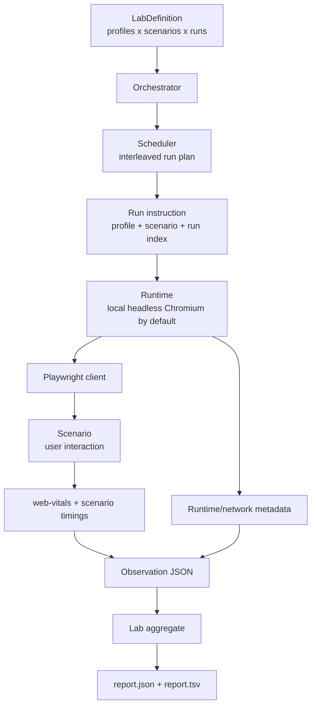

# CWV Test Bench

This repository is a Core Web Vitals test bench for measuring real user paths
under controlled browser runtime conditions. The current main target is
Euro.com.pl, with the primary focus on INP.

Start here:

| Document | Use |
| --- | --- |
| [AGENTS.md](./AGENTS.md) | Agent/contributor onboarding, current objective, repository map, guardrails |
| [SKILLS.md](./SKILLS.md) | Operational playbooks for recurring tasks |
| [src/experiments/README.md](./src/experiments/README.md) | Experiment layout and extension rules |
| [src/experiments/lab/README.md](./src/experiments/lab/README.md) | Lab experiment entry points |
| [src/experiments/runtime/README.md](./src/experiments/runtime/README.md) | Runtime comparison and smoke-test entry points |

## What This Bench Does

The bench runs Playwright scenarios against a real page, collects web-vitals and
scenario-level timing data, repeats each profile/scenario combination, and
aggregates the observations into reports.


```mermaid
flowchart TD
  A["LabDefinition<br/>profiles x scenarios x runs"] --> B["Orchestrator"]
  B --> C["Scheduler<br/>interleaved run plan"]
  C --> D["Run instruction<br/>profile + scenario + run index"]
  D --> E["Runtime<br/>local headless Chromium by default"]
  E --> F["Playwright client"]
  F --> G["Scenario<br/>user interaction"]
  G --> H["web-vitals + scenario timings"]
  E --> I["Runtime/network metadata"]
  H --> J["Observation JSON"]
  I --> J
  J --> K["Lab aggregate"]
  K --> L["report.json + report.tsv"]
```

## Ownership Boundaries

Keep the system split across these layers:

| Layer | Owns | Main files |
| --- | --- | --- |
| Lab | Methodology, profiles, scenarios, validation, aggregation | `src/experiments/lab/`, `src/lab/` |
| Runtime | Browser process/session, target URL, network policy, warmup | `src/runtime/`, `src/runtime/essentials/` |
| Client/scenario | Playwright user path and web-vitals collection | `src/scenarios/playwright-web-vitals/` |
| Orchestrator | Scheduling, runtime API calls, persistence | `src/orchestrator/` |

Do not put scenario behaviour into runtime code. Do not put browser or network
setup into scenario code when the runtime API already owns it.

## Repository Map

| Path | Purpose |
| --- | --- |
| `src/experiments/lab/euro-cwv-lab/` | Main Euro lab definition: profiles, scenarios, methodology |
| `src/experiments/lab/euro-menu-lab/` | Focused hamburger-menu lab wrapper |
| `src/experiments/runtime/` | Runtime-specific Euro menu runs and replay smoke tests |
| `src/runtime/*.ts` | Concrete runtime implementations |
| `src/runtime/essentials/` | Shared runtime API and core types |
| `src/runtime/driver/cdp/` | CDP browser session, blocking, warmup, response cache |
| `src/scenarios/playwright-web-vitals/` | Playwright scenarios and instrumentation helpers |
| `src/lab/` | Report contract, aggregation, validation, result writer |
| `src/orchestrator/` | Session loop, scheduling, runtime API client |
| `bench-results/` | Generated observations and reports; do not commit by default |

## Euro Runtime Model

The current primary methodology is live local Chromium headless. Offline replay
and Docker/Xvfb are useful controls, but they are not the primary evidence path.

The main comparison is:

```text
baseline vs euro-menu-baseline-scripts-blocked
```

Run it across these runtime variants when validating portability:

| Runtime | Script |
| --- | --- |
| Local Chromium headless (primary) | `npm run bench:runtime:euro:menu:local-headless` |
| Docker + Xvfb + container Chromium | `npm run bench:runtime:euro:menu:docker-headful-xvfb` |
| Local Chromium headful | `npm run bench:runtime:euro:menu:local-headful` |

All three runtime comparison variants disable runtime-managed replay cache so
they behave like normal browser runs.

Known caveat: Docker + Xvfb can diverge from local Chromium. If only Docker/Xvfb
shows a regression, compare against both local runtime variants before treating
it as page behaviour.

## Environment Variables

| Variable | Scope | Notes |
| --- | --- | --- |
| `EURO_APP_URL` | Euro profile builder | Default target URL for Euro profiles; falls back to `https://www.euro.com.pl/` |
| `PLAYWRIGHT_BASE_URL` | Runtime/client override | Generic override that wins over profile `network.baseUrl` |
| `EURO_SYZYGY_DEV_COOKIE` | Scenario helper | Optional value for the `syzygyDev` cookie |
| `BENCH_REPLICATES` | Lab methodology | Overrides replicate count |
| `BENCH_PROFILE_IDS` | Euro lab runner | Comma-separated subset of profile IDs |
| `BENCH_DEBUG_ARTIFACTS` | Scenario diagnostics | Enables screenshots, network/console dumps, and debug JSON |
| `BENCH_CHROME_TRACE` | Scenario diagnostics | Captures Chrome trace artifacts when supported |
| `BENCH_CPU_PROFILE` | Scenario diagnostics | Captures CPU profile artifacts when supported |

Secrets belong in local `.env`, not in committed files:

```text
EURO_SYZYGY_DEV_COOKIE=
```

`.env` and `.env.local` are ignored by git. Commit only `.env.example` with
empty placeholders.

## Euro Methodology

Current active profiles:

| Profile | Purpose |
| --- | --- |
| `baseline` | Warmed browser cache and default runtime network behaviour |
| `euro-menu-baseline-scripts-blocked` | Baseline profile with external scripts blocked |
| `euro-menu-browser-cache-cold` | Cold browser cache |
| `euro-menu-browser-cache-disabled` | Browser cache disabled and runtime network cache disabled |

Current methodology:

```text
metric: inpMs
metricBoundaries: inpMs 10..300, eventTimingMaxMs 10..300
summary: median / mean / min / max / delta / out-of-range
schedule: interleave
gate: baseline + acceptableDeltaMs = 40
default replicates: 10
```

Current Euro scenarios:

| Scenario | Spec | Status |
| --- | --- | --- |
| Hamburger menu | `euro-open-menu.spec.ts` | active |
| Search layer | `euro-search-layer.spec.ts` | active |
| Rotator banner click | `euro-rotator-banner-click.spec.ts` | active |
| Product box to PDP | `euro-product-box-to-pdp.spec.ts` | active |
| Product box card click | `euro-product-box-card-click.spec.ts` | active |
| Listing open filters | `euro-listing-open-filters.spec.ts` | active |
| Add to cart | `euro-add-to-cart.spec.ts` | active |
| Standard/installments tab | `euro-product-standard-installments-tab.spec.ts` | active |
| Listing sort | `euro-listing-sort.spec.ts` | active |
| Listing quick filter | `euro-listing-quick-filter.spec.ts` | active |
| Listing brand filter | `euro-listing-brand-filter.spec.ts` | active |
| Listing price filter | `euro-listing-price-filter.spec.ts` | active |
| Listing scroll products | `euro-listing-scroll-products.spec.ts` | active |
| Promo tag click | `euro-promo-tag-click.spec.ts` | broken/disabled |

`promo tag click` is kept as a disabled catalog entry because the current live
campaign no longer exposes a stable matching target. It is excluded from the
default Euro methodology experiments.

PDP and listing scenarios must be defensive around Euro block pages. If the page
blocks the path, record that state in metrics or `meta` instead of pretending
the full path succeeded.

## Running

Install dependencies:

```bash
npm ci
```

Typecheck:

```bash
npx tsc --noEmit
```

Run the main Euro lab through the primary local headless runtime:

```bash
npm run bench:euro
```

Run the focused hamburger-menu lab:

```bash
npm run bench:euro:menu
```

Run the current primary comparison as a small smoke check:

```bash
BENCH_REPLICATES=3 \
BENCH_PROFILE_IDS=baseline,euro-menu-baseline-scripts-blocked \
npm run bench:runtime:euro:menu:local-headless
```

Run all runtime controls with the same inputs:

```bash
BENCH_REPLICATES=3 \
BENCH_PROFILE_IDS=baseline,euro-menu-baseline-scripts-blocked \
npm run bench:runtime:euro:menu:docker-headful-xvfb

BENCH_REPLICATES=3 \
BENCH_PROFILE_IDS=baseline,euro-menu-baseline-scripts-blocked \
npm run bench:runtime:euro:menu:local-headful
```

Run with debug artifacts:

```bash
BENCH_REPLICATES=1 \
BENCH_PROFILE_IDS=baseline,euro-menu-baseline-scripts-blocked \
BENCH_DEBUG_ARTIFACTS=1 \
npm run bench:runtime:euro:menu:local-headless
```

## Reading Results

Reports are written to:

```text
bench-results/observations/<sessionId>/
bench-results/summary/<sessionId>/report.json
bench-results/summary/<sessionId>/report.tsv
```

Set `BENCH_OPENSEARCH_URL` to also publish each completed session to
OpenSearch. The publisher creates the target index if it is missing and writes
one session document plus summary and observation documents.

```bash
BENCH_OPENSEARCH_URL=https://opensearch-cluster-master.platform-shared-resources.svc.cluster.local:9200 \
BENCH_OPENSEARCH_INDEX=cwv-bench-runs \
BENCH_OPENSEARCH_USERNAME='<writer-username>' \
BENCH_OPENSEARCH_PASSWORD='<writer-password>' \
BENCH_OPENSEARCH_INSECURE_TLS=1 \
npm run bench:runtime:euro:menu:local-headless
```

Use `report.tsv` for quick comparisons. Important columns:

| Column | Meaning |
| --- | --- |
| `profileId` | Tested profile |
| `scenarioId` | Tested scenario |
| `metric` | Aggregated metric |
| `median`, `mean`, `min`, `max` | Qualified sample statistics |
| `delta` | `max - min` inside this row |
| `baselineMedianDelta` | Difference vs baseline profile |
| `gate` | Pass/fail only for the methodology primary metric |

For INP diagnosis, read `inpPresentationDelayMs`, `inpInputDelayMs`, and
`inpProcessingDurationMs` alongside `inpMs`.

## How To Extend

Use [SKILLS.md](./SKILLS.md) for step-by-step playbooks. The short version:

| Task | Start here |
| --- | --- |
| Add a Euro user path | `Skill: Add A Euro Scenario` |
| Add or change a profile | `Skill: Add Or Change A Euro Profile` |
| Add a lab experiment wrapper | `Skill: Add A Lab Experiment` |
| Add a runtime variant | `Skill: Add Or Change A Runtime` |
| Add a report column | `Skill: Change Report Metrics` |

## Threesixty Platform

The GitOps-first solution setup lives in
[docs/threesixty-platform-integration.md](./docs/threesixty-platform-integration.md).
It is meant for GitHub App onboarding as an external solution, not as a
built-in `threesixty-platform` repository solution.

The onboarding entry point is `.platform/cwv-test-bench.environment.yaml`.
It selects the service workload manifests in `manifests/cwv-test-bench-runner`.
The assumed OpenSearch index claim is declared directly in the environment
manifest under `spec.manifests.resourceClaims`.
The packed runner image is built and pushed by
`.github/workflows/cwv-test-bench-image.yaml`.

When adding a scenario, create a `euro-*.spec.ts` file, register a stable ID and
spec path in `src/experiments/lab/euro-cwv-lab/definition.ts`, and include it in
`euroMenuMethodologyLab.scenarios` only after it is stable enough for the default
methodology. If a scenario is useful for reference but currently broken, keep it
in `euroMenuMethodologyDisabledScenarios` instead.

When adding an experiment, keep the `LabDefinition` in the lab layer and use an
`experiment.ts` entry point or wrapper to select profiles, scenarios, replicates,
and runtime. Add an npm script only when the experiment should be a first-class
command.

## Verification Before Handoff

For code changes:

```bash
npx tsc --noEmit
git diff --check
```

For runtime or report changes, also run at least one small runtime comparison:

```bash
BENCH_REPLICATES=3 \
BENCH_PROFILE_IDS=baseline,euro-menu-baseline-scripts-blocked \
npm run bench:runtime:euro:menu:local-headless
```

If changing runtime portability, run all three runtime variants with the same
profiles and replicate count.
